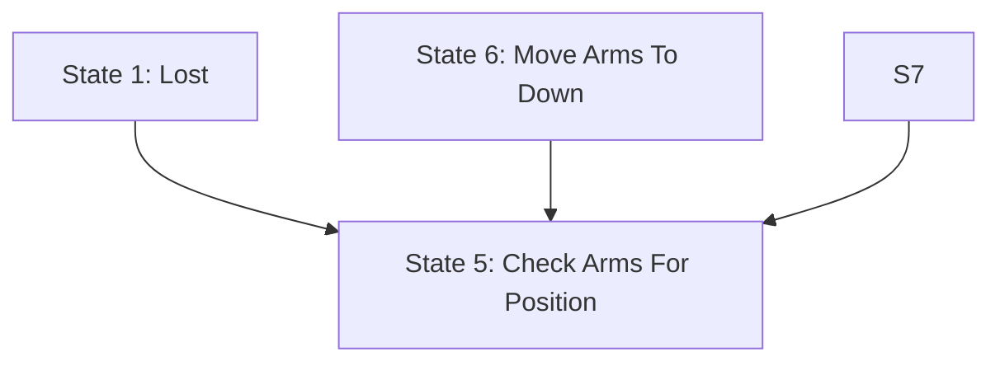

# L5X State Logic Analysis - Research Notes

## Project Overview
Analyzing the L5X file format to extract state machine logic and generate Mermaid flowchart diagrams.

**Sample File**: `data/_A28_PalletHandler_Routine_RLL.L5X`

---

## L5X Python Library Structure

### Loading a Project
```python
import l5x
prj = l5x.Project('path/to/file.L5X')
```

### Document Structure
```
RSLogix5000Content (root)
└── Controller
    ├── DataTypes
    ├── Modules
    ├── AddOnInstructionDefinitions
    ├── Tags (Controller-level tags)
    └── Programs
        └── Program (e.g., "Robotic_Cell")
            ├── Tags (Program-level tags)
            └── Routines
                └── Routine (e.g., "_A28_PalletHandler")
                    ├── CustomProperties
                    ├── Description
                    └── RLLContent (Relay Ladder Logic)
                        └── Rung (multiple)
                            ├── Comment
                            │   └── CDATAContent (actual comment text)
                            └── Text
                                └── CDATAContent (ladder logic code)
```

### Key API Access Patterns

#### Accessing Programs
```python
# Via l5x API
program_names = prj.programs.names  # List of program names
program = prj.programs['Robotic_Cell']  # Get specific program

# Program is a Scope object with:
# - program.element: XML element
# - program.tags: ElementDict of tags
```

#### Accessing Routines
```python
# Must access via XML directly - no API wrapper
routines_elem = program.element.find('Routines')
routine = routines_elem.find("Routine[@Name='_A28_PalletHandler']")

# Routine attributes
routine.attrib['Name']  # '_A28_PalletHandler'
routine.attrib['Type']  # 'RLL' for ladder logic
```

#### Accessing Rungs
```python
rll_content = routine.find('RLLContent')
for rung in rll_content:
    rung_number = rung.attrib.get('Number')
    rung_type = rung.attrib.get('Type')  # Usually 'N' for normal
```

#### Accessing Rung Comments and Logic
**IMPORTANT**: Comments and ladder logic text are stored in CDATAContent child elements!

```python
# Get rung comment
comment = rung.find('Comment')
if comment is not None:
    cdata = comment.find('CDATAContent')
    if cdata is not None and cdata.text:
        comment_text = cdata.text

# Get ladder logic text
text = rung.find('Text')
if text is not None:
    text_cdata = text.find('CDATAContent')
    if text_cdata is not None and text_cdata.text:
        ladder_logic = text_cdata.text
```

---

## State Logic Structure in Sample File

### Finding the State Logic Section
1. Look for a rung with a comment containing "STATE LOGIC"
2. In our sample file, this is **Rung 11**
3. Rung 12 is a cleanup rung (FLL instruction to clear new state array)
4. **Rung 13 onwards** contains the actual state transition logic

### State Logic Section Marker Comment
```
*****************************************
STATE LOGIC
*****************************************
- This logic defines the transitions from the current state to a new state.
States represent finite, mutually exclusive steps in the sequence of operation -
this section is always in one state, and never in more than one state at any time.
```

### State Rung Structure
Each state rung follows this pattern:
- Starts with `XIC(tag)` instruction (Examine If Closed)
- The tag being examined indicates which state this rung represents
- Contains conditional logic (additional XIC, XIO instructions)
- Ends with `OTL(tag)` instruction(s) (Output Latch) for state transitions
- Each OTL sets a new state bit

### Example State Rungs
```
Rung 13:
  XIC: _A28_PH.ST[0].1
  OTL: _A28_PH.NST[0].5
  Meaning: If in State 1 (and conditions met), transition to State 5

Rung 19:
  XIC: _A28_PH.ST[0].6
  OTL: _A28_PH.NST[0].5
  Meaning: If in State 6 (and conditions met), transition to State 5

Rung 20:
  XIC: _A28_PH.ST[0].7
  OTL: _A28_PH.NST[0].5
  Meaning: If in State 7 (and conditions met), transition to State 5
```

### Parsing Ladder Logic Instructions

#### XIC Extraction (State Identifier)
```python
import re
logic_text = text_cdata.text.strip()
xic_match = re.match(r'XIC\(([^)]+)\)', logic_text)
if xic_match:
    xic_tag = xic_match.group(1)  # e.g., '_A28_PH.ST[0].1'
```

#### OTL Extraction (State Transitions)
```python
otl_matches = re.findall(r'OTL\(([^)]+)\)', logic_text)
# Returns list of target state tags, e.g., ['_A28_PH.NST[0].5', '_A28_PH.NST[0].14']
```

---

## Tag Structure and State Descriptions

### StateLogic Data Type
The main tag `_A28_PH` is of type `StateLogic` (custom data type) with members:
- **ST**: State bits (current state) - Array of DINT
- **NST**: New State bits (target state) - Array of DINT
- Plus many other members for control logic

### Accessing State Information

#### Get the State Tag
```python
tag = prj.controller.tags['_A28_PH']
# tag.data_type = 'StateLogic'
# tag.description = 'EMPTY SECTION'
```

#### Access State Array
```python
st_member = tag['ST']  # Array of DINT
st_0 = st_member[0]     # First DINT (holds states 0-31)
```

#### Access Individual State Bit Descriptions
```python
# Each state is a bit in the DINT
for state_num in [1, 5, 6, 7, 10, 11, 12, 14, 15, 16, 17]:
    bit = st_0[state_num]
    description = bit.description
    # description contains "State X\nDescription Text"
```

### State Description Format
Each bit description follows this format:
```
State 1
Lost

State 5
Check Arms For Position

State 6
Move Arms To Down

State 7
Move Arms To Out
```

First line: "State {number}"
Remaining lines: State name/description

---

## Parsing Tag References

### Tag Reference Format
- `_A28_PH.ST[0].1` = Tag `_A28_PH`, member `ST`, array index `[0]`, bit `.1`
- `_A28_PH.NST[0].5` = Tag `_A28_PH`, member `NST`, array index `[0]`, bit `.5`

### Extracting State Number
```python
# From XIC tag: _A28_PH.ST[0].1
match = re.search(r'\.(\d+)$', xic_tag)
if match:
    state_num = int(match.group(1))  # 1

# From OTL tag: _A28_PH.NST[0].5
match = re.search(r'\.(\d+)$', otl_tag)
if match:
    target_state_num = int(match.group(1))  # 5
```

---

## Algorithm for Extracting State Machine

### Step 1: Find State Logic Section
```python
for i, rung in enumerate(rll_content):
    comment = rung.find('Comment')
    if comment is not None:
        cdata = comment.find('CDATAContent')
        if cdata is not None and cdata.text and 'STATE LOGIC' in cdata.text:
            state_logic_start_index = i
            break
```

### Step 2: Iterate Through State Rungs
```python
rungs_list = list(rll_content)
for i in range(state_logic_start_index + 2, len(rungs_list)):  # Skip cleanup rung
    rung = rungs_list[i]
    # Process each rung...
```

### Step 3: Extract State and Transitions
```python
# Get ladder logic
text = rung.find('Text')
text_cdata = text.find('CDATAContent')
logic = text_cdata.text.strip()

# Extract source state (first XIC)
xic_match = re.match(r'XIC\(([^)]+)\)', logic)
if xic_match:
    xic_tag = xic_match.group(1)
    source_state_num = extract_state_number(xic_tag)

    # Extract target states (all OTLs)
    otl_matches = re.findall(r'OTL\(([^)]+)\)', logic)
    target_state_nums = [extract_state_number(tag) for tag in otl_matches]
```

### Step 4: Look Up State Names
```python
def get_state_name(state_num, tag_name='_A28_PH'):
    tag = prj.controller.tags[tag_name]
    st_0 = tag['ST'][0]
    bit = st_0[state_num]
    description = bit.description

    if description:
        lines = description.strip().split('\n')
        # lines[0] = "State X"
        # lines[1+] = actual state name
        state_name = '\n'.join(lines[1:]).strip()
        return state_name
    return f"State {state_num}"
```

### Step 5: Build State Transition Graph
```python
# Data structure: dict mapping state_num -> list of target_state_nums
state_transitions = {}

for rung in state_rungs:
    source_state = extract_source_state(rung)
    target_states = extract_target_states(rung)

    if source_state not in state_transitions:
        state_transitions[source_state] = []

    state_transitions[source_state].extend(target_states)

# Remove duplicates
for state in state_transitions:
    state_transitions[state] = list(set(state_transitions[state]))
```

---

## Mermaid Flowchart Generation

### Format for Flowchart


### Code Template
```python
def generate_mermaid(state_transitions, state_names):
    lines = ['flowchart TD']

    # Define all states
    all_states = set(state_transitions.keys())
    for targets in state_transitions.values():
        all_states.update(targets)

    for state_num in sorted(all_states):
        name = state_names.get(state_num, f"State {state_num}")
        lines.append(f'    S{state_num}[State {state_num}: {name}]')

    lines.append('')

    # Define transitions
    for source_state in sorted(state_transitions.keys()):
        for target_state in sorted(state_transitions[source_state]):
            lines.append(f'    S{source_state} --> S{target_state}')

    return '\n'.join(lines)
```

---

## Edge Cases and Considerations

### Multiple Rungs for Same State
Some states have multiple rungs (different conditions leading to different transitions):
- Rung 15, 16, 17, 18 all start with `XIC(_A28_PH.ST[0].5)` (State 5)
- Each has different OTL targets based on different conditions
- **Solution**: Collect all unique target states across all rungs for a given source state

### NOP() Rungs
Some rungs contain `NOP()` (No Operation) - these are documentation/comment rungs:
```
Rung 14:
  Comment: State 5 - Check Arms Position...
  Logic: NOP();
```
- **Solution**: Skip rungs with only NOP() instructions

### Cleanup/Reset Rungs
Rung immediately after STATE LOGIC marker is typically a cleanup rung:
```
XIC(_A28_PH.State_Change)[FLL(0,_A28_PH.NST[0],3) ,OTU(_A28_PH.State_Change) ];
```
- **Solution**: Start processing from `state_logic_start + 2` to skip marker and cleanup

### End of State Logic Section
Typically indicated by a comment like "FAULT / MESSAGE LOGIC":
```
Rung 32 Comment:
*****************************************
FAULT / MESSAGE LOGIC
*****************************************
```
- **Solution**: Stop when encountering a new section marker or no more state rungs

---

## Complete Workflow Summary

1. **Load Project**: `prj = l5x.Project(filename)`
2. **Navigate to Routine**: Program → Routines → Routine → RLLContent
3. **Find STATE LOGIC**: Search rung comments for "STATE LOGIC"
4. **Parse State Rungs**: Extract XIC (source) and OTL (targets) from ladder logic
5. **Look Up State Names**: Access tag bit descriptions via `prj.controller.tags[tag_name]['ST'][0][bit_num].description`
6. **Build Transition Map**: Create dict of source_state → [target_states]
7. **Generate Mermaid**: Format as flowchart with nodes and edges
8. **Save to File**: Write to .md file

---

## Testing Notes

### Sample File States Found
States present in sample file: 1, 3, 5, 6, 7, 10, 11, 12, 14, 15, 16, 17

### Example Transitions Observed
- State 1 → State 5
- State 5 → States 14, 15, 10, 12, 11, 7, 16, 17 (multiple possible transitions)
- State 6 → State 5
- State 7 → State 5

### State Names
- State 1: Lost
- State 5: Check Arms For Position
- State 6: Move Arms To Down
- State 7: Move Arms To Out
- State 10: Move Arms To Middle
- State 11: Move Arms To In
- State 12: Move Arms To Up
- State 14: Single Pallet Ready Arms Clear
- State 15: Pallets Raised Off Conveyor Arms Clear
- State 16: Stack Released Arms Down And Out
- State 17: Pallet Stack Full In Stacking Mode. Arms Down And Out

---

## Implementation Checklist

- [x] Load L5X file using l5x library
- [x] Navigate to RLLContent
- [x] Find STATE LOGIC section
- [x] Parse XIC and OTL instructions
- [x] Access tag bit descriptions
- [ ] Build complete state transition map
- [ ] Handle edge cases (NOP, multiple rungs, duplicates)
- [ ] Generate Mermaid flowchart syntax
- [ ] Save to .md file
- [ ] Add command-line interface
- [ ] Add error handling
- [ ] Test with sample file

---

## Next Steps

1. Create Python script `l5x_state_diagram.py`
2. Implement state extraction logic
3. Implement Mermaid generation logic
4. Add CLI with argparse
5. Test and debug with sample file
6. Document usage in README
