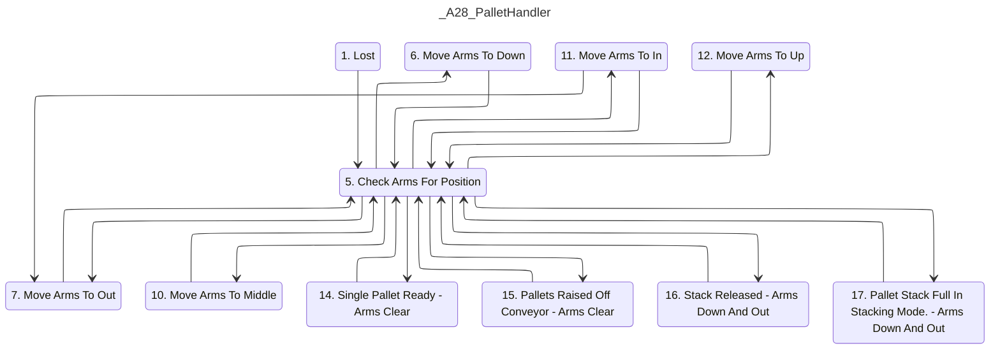

# State Logic Diagram

```mermaid
---
title: _A28_PalletHandler
config:
  layout: elk
---

stateDiagram-v2
    direction TB

    S1 : 1. Lost
    S5 : 5. Check Arms For Position
    S6 : 6. Move Arms To Down
    S7 : 7. Move Arms To Out
    S10 : 10. Move Arms To Middle
    S11 : 11. Move Arms To In
    S12 : 12. Move Arms To Up
    S14 : 14. Single Pallet Ready - Arms Clear
    S15 : 15. Pallets Raised Off Conveyor - Arms Clear
    S16 : 16. Stack Released - Arms Down And Out
    S17 : 17. Pallet Stack Full In Stacking Mode. - Arms Down And Out

    S1 --> S5
    S5 --> S6
    S5 --> S7
    S5 --> S10
    S5 --> S11
    S5 --> S12
    S5 --> S14
    S5 --> S15
    S5 --> S16
    S5 --> S17
    S6 --> S5
    S7 --> S5
    S10 --> S5
    S11 --> S5
    S11 --> S7
    S12 --> S5
    S14 --> S5
    S15 --> S5
    S16 --> S5
    S17 --> S5
```
