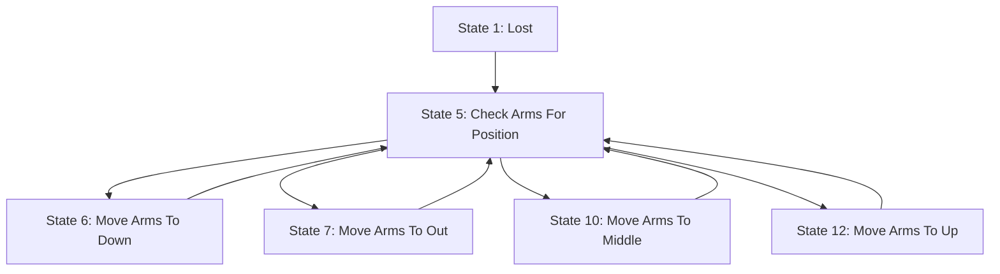

# L5X State Logic Diagram Generator

A Python tool that extracts state machine logic from Rockwell Automation L5X (RSLogix/Studio 5000) files and generates Mermaid flowchart diagrams.

Available in two versions:
- **GUI Application** - User-friendly drag-and-drop interface
- **Command Line Tool** - For automation and scripting

## Features

- Automatically finds STATE LOGIC sections in L5X files
- Extracts state numbers and descriptive names from tag bit descriptions
- Maps state transitions by analyzing ladder logic (XIC/OTL instructions)
- Generates clean Mermaid flowchart syntax
- Auto-detects StateLogic tags or accepts custom tag names
- Outputs to markdown files for easy viewing

## Requirements

- Python 3.7+
- l5x library
- PySide6 (for GUI only)

## Installation

1. Create a virtual environment:
```bash
python3 -m venv venv
```

2. Activate the virtual environment:
```bash
source venv/bin/activate  # On Linux/Mac
# or
venv\Scripts\activate  # On Windows
```

3. Install required libraries:
```bash
pip install l5x PySide6
```

## Usage

### GUI Application (Recommended)

Launch the graphical interface:
```bash
python l5x_mermaid_gui.py
```

Then:
1. **Drag and drop** your .L5X file onto the drop zone (or click to browse)
2. Optionally enter a tag name (leave empty to auto-detect)
3. Choose where to save the output file (auto-suggested)
4. Click **Generate Diagram**
5. View progress and results in the status box

### Command Line Tool

Generate a state diagram from an L5X file:
```bash
python l5x_state_diagram.py input.L5X
```

This will create `input_state_diagram.md` in the same directory.

### Custom Output File

Specify a custom output file:
```bash
python l5x_state_diagram.py input.L5X -o my_diagram.md
```

### Specify State Tag Name

If your L5X file has multiple StateLogic tags, specify which one to use:
```bash
python l5x_state_diagram.py input.L5X -t _A28_PH
```

### Help

View all options:
```bash
python l5x_state_diagram.py --help
```

## How It Works

### 1. STATE LOGIC Section Detection

The tool searches for a rung comment containing "STATE LOGIC" which marks the beginning of the state machine section in the ladder logic.

### 2. State Extraction

Each state is identified by:
- **XIC (Examine If Closed)** instruction at the start of a rung
- The XIC examines a state bit like `_A28_PH.ST[0].5` where `5` is the state number
- State names are retrieved from the tag bit descriptions

### 3. Transition Mapping

State transitions are identified by:
- **OTL (Output Latch)** instructions in the rung
- Each OTL sets a target state bit like `_A28_PH.NST[0].14` where `14` is the target state
- Multiple OTLs in a rung indicate multiple possible transitions

### 4. Mermaid Generation

The tool generates a flowchart with:
- Each state as a labeled node: `S5[State 5: Check Arms For Position]`
- Transitions as directed edges: `S5 --> S14`

## Example Output

For a pallet handler state machine, the generated diagram might look like:



## Viewing the Diagram

The output markdown file can be viewed in:
- **GitHub/GitLab**: Automatically renders Mermaid diagrams
- **VS Code**: Install "Markdown Preview Mermaid Support" extension
- **Online**: [Mermaid Live Editor](https://mermaid.live/)
- **Other editors**: Any markdown viewer with Mermaid support

## L5X File Requirements

Your L5X file must contain:
1. A routine with ladder logic (RLL type)
2. A rung comment containing "STATE LOGIC" to mark the section
3. State machine implemented with:
   - State bits in a tag (commonly of type `StateLogic`)
   - XIC instructions to check current state
   - OTL instructions to set new states

## Troubleshooting

### "No STATE LOGIC section found"

Your L5X file doesn't contain a rung comment with "STATE LOGIC". Check your ladder logic for the state machine section.

### "Could not auto-detect state tag"

The tool couldn't find a StateLogic tag. Manually specify the tag name:
```bash
python l5x_state_diagram.py input.L5X -t YOUR_TAG_NAME
```

### "Invalid L5X file"

The file is not a valid L5X export. Ensure you exported the routine from Studio 5000/RSLogix with ladder logic included.

## Project Structure

```
L5X/
├── l5x_mermaid_gui.py          # GUI application
├── l5x_state_diagram.py        # Command-line tool
├── README.md                   # This file
├── CLAUDE.md                   # Development notes and research
├── data/                       # Sample L5X files
│   └── _A28_PalletHandler_Routine_RLL.L5X
└── venv/                       # Python virtual environment
    └── ...
```

## Development

### Research Notes

See `CLAUDE.md` for detailed notes on:
- L5X file structure
- l5x library API usage
- State machine parsing algorithm
- Implementation details

### Testing

Test the tool with the included sample file:
```bash
python l5x_state_diagram.py data/_A28_PalletHandler_Routine_RLL.L5X
```

Expected output:
- 11 source states found
- 20 total transitions
- States: 1, 5, 6, 7, 10, 11, 12, 14, 15, 16, 17

## License

This tool was generated with Claude Code for analyzing industrial automation logic files.

## References

- [l5x Python Library](https://github.com/jvalenzuela/l5x)
- [Mermaid Documentation](https://mermaid.js.org/)
- [Studio 5000 (RSLogix)](https://www.rockwellautomation.com/en-us/products/software/factorytalk/operationsuite/studio-5000.html)
